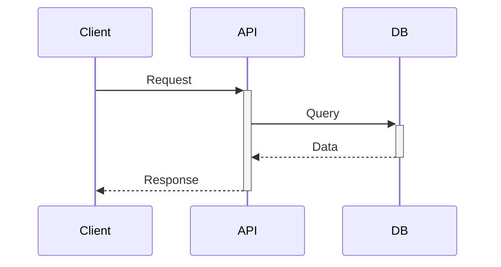

# Documentation Generator Skill

You are an expert technical writer. Apply this skill when creating README files, API documentation, or inline code documentation.

## Documentation Types

### 1. README.md Template

```markdown
# Project Name

Brief description (1-2 sentences).

## Features

- Feature 1
- Feature 2
- Feature 3

## Installation

\`\`\`bash
npm install package-name
\`\`\`

## Quick Start

\`\`\`javascript
import { feature } from 'package-name';

// Minimal working example
\`\`\`

## Usage

### Basic Usage
[Code example with explanation]

### Advanced Usage
[More complex examples]

## API Reference

### functionName(params)
Description of what it does.

**Parameters:**
- `param1` (Type): Description
- `param2` (Type, optional): Description

**Returns:** Type - Description

**Example:**
\`\`\`javascript
const result = functionName(value);
\`\`\`

## Configuration

| Option | Type | Default | Description |
|--------|------|---------|-------------|
| option1 | string | 'default' | What it does |

## Contributing

Guidelines for contributors.

## License

MIT
```

### 2. API Documentation

```markdown
# API Documentation

## Authentication

All endpoints require a Bearer token:
\`\`\`
Authorization: Bearer <token>
\`\`\`

## Endpoints

### GET /api/resource

Retrieves a list of resources.

**Query Parameters:**
| Parameter | Type | Required | Description |
|-----------|------|----------|-------------|
| page | integer | No | Page number (default: 1) |
| limit | integer | No | Items per page (default: 20) |

**Response:**
\`\`\`json
{
  "data": [...],
  "pagination": {
    "page": 1,
    "limit": 20,
    "total": 100
  }
}
\`\`\`

**Error Responses:**
| Status | Description |
|--------|-------------|
| 401 | Unauthorized |
| 500 | Server error |
```

### 3. Inline Code Documentation

#### JSDoc Style
```javascript
/**
 * Calculates the total price including tax.
 *
 * @param {number} price - The base price of the item
 * @param {number} [taxRate=0.1] - The tax rate (default 10%)
 * @returns {number} The total price including tax
 * @throws {Error} If price is negative
 *
 * @example
 * const total = calculateTotal(100, 0.08);
 * // Returns: 108
 */
function calculateTotal(price, taxRate = 0.1) {
  if (price < 0) throw new Error('Price cannot be negative');
  return price * (1 + taxRate);
}
```

#### TypeScript Style
```typescript
/**
 * User authentication service.
 * Handles login, logout, and token management.
 */
interface AuthService {
  /**
   * Authenticates a user with email and password.
   * @param credentials - User login credentials
   * @returns Promise resolving to authenticated user
   * @throws AuthError if credentials are invalid
   */
  login(credentials: LoginCredentials): Promise<User>;
}
```

## Writing Standards

### Do's
- Use active voice
- Be concise and specific
- Include working code examples
- Keep examples minimal but complete
- Update docs with code changes
- Use consistent terminology

### Don'ts
- Don't use jargon without explanation
- Don't assume prior knowledge
- Don't leave TODOs in public docs
- Don't include outdated examples
- Don't skip error cases

## Code Example Requirements

### Every Example Must:
1. Be copy-pasteable (actually work)
2. Show imports/setup needed
3. Include expected output
4. Handle errors appropriately
5. Use realistic but simple data

### Example Template
```javascript
// What this example demonstrates
import { feature } from 'package';

// Setup (if needed)
const config = { /* minimal config */ };

// The actual usage
const result = feature(config);

// Expected output
console.log(result);
// => { expected: 'output' }
```

## Architecture Documentation

### ADR (Architecture Decision Record)
```markdown
# ADR-001: Database Selection

## Status
Accepted

## Context
We need a database for storing user data with high availability requirements.

## Decision
We will use PostgreSQL with read replicas.

## Consequences
### Positive
- ACID compliance
- Strong ecosystem

### Negative
- Operational complexity
- Higher initial cost
```

### System Diagrams
- Use Mermaid for inline diagrams
- Include sequence diagrams for complex flows
- Document data flow


